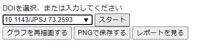

# 論文ランダムウォーク
URL
## 概要
自分で指定した任意の論文から、引用関係を”_ランダム_”にたどることができるアプリケーションです。一口に引用といってもいろいろな引用(批判的なものであったり、イントロで全く別分野のものを引用するなど)がありますので、思わぬ発見に導いてくれるかもしれません。  
研究評価において被引用数が用いられますが、単なるスカラー値の裏にあるいろいろな引用をもう一度考えるきっかけにしてみてください。もちろん、この膨大な情報を[CC0](https://creativecommons.org/publicdomain/zero/1.0/deed.ja){:target="_blank"}で公開している[OpenCitations](https://opencitations.net/){:target="_blank"}をはじめとした論文データに関するオープンデータの取り組みを知ってもらえると嬉しいです。
### こんな発見があるかも？  
- 気が付いたら全く違う内容の論文にたどり着いているかも？
- 引用をたどることで、以外と自分に近い研究分野の人に巡り合えるかも？(似た論文を引用している人は競争者か？協力者か？)
- どんなに進んでも、大御所研究グループの論文から抜け出すことができない？

## 遊び方
### １．元論文を入力する
最初は元の論文を入力するところから開始します。  
例えば他にも以下の論文などを検索してみると面白いかもしれません。  
- [10.1143/JPSJ.73.2593](https://doi.org/10.1143/JPSJ.73.2593){:target="_blank"}, 113番目の元素ニホニウム発見の主要な論文の一つ
- [10.1016/j.cell.2006.07.024](https://doi.org/10.1016/j.cell.2006.07.024){:target="_blank"}, 2021年ノーベル賞のiPS細胞発見の主要な論文の一つ

### ２．ランダムウォークする
論文をマウスオーバーすると、「citing」「cited」の選択肢が現れます。「citing」=その論文が”_引用している_”論文、「cited」=その論文が”_引用されている_”論文、がランダムで一報追加されます。これを繰り返すことでランダムウォークできます。  
同じ論文から、「citing」「cited」の両方にもランダムウォークを伸ばすことができますし、「citing」の中で複数の論文にランダムウォークを伸ばすこともできます。(「cited」も同様)

### ３．ランダムウォーク結果をサマリする
「」ボタンを押すとランダムウォークした論文群をサマリする画面に遷移します。  

「」ボタンからhtmlページとしてサマリ結果をダウンロードすることもできます。  
※この処理はAPIをもう一度呼び出す必要があるため、最大数分程度、処理に時間がかかります。

## 利用しているデータ
- [REST API FOR COCI, THE OPENCITATIONS INDEX OF CROSSREF OPEN DOI-TO-DOI REFERENCES](https://opencitations.net/index/coci/api/v1){:target="_blank"}.
- [Scimago Journal & Country Rank](http://www.scimagojr.com/){:target="_blank"}(サマリのみ), retrieved 2021-09-12.

## ライセンス
本アプリケーションならびに付属の説明資料等はすべて[クリエイティブ・コモンズ国際 (CC BY 4.0)](https://creativecommons.org/licenses/by/4.0/deed.ja){:target="_blank"}です。  
クレジットを記載する際には以下のように表示していただけると助かります。
- 「論文ランダムウォーク」(https://k2taro.github.io/scholarly-paper-randomwalk/) 松本尚也, 渡邊勝太郎
- ”Scholarly paper Random Walk”(https://k2taro.github.io/scholarly-paper-randomwalk/). Naoya Matsumoto, Katsutaro Watanabe.
