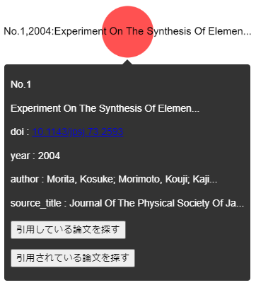
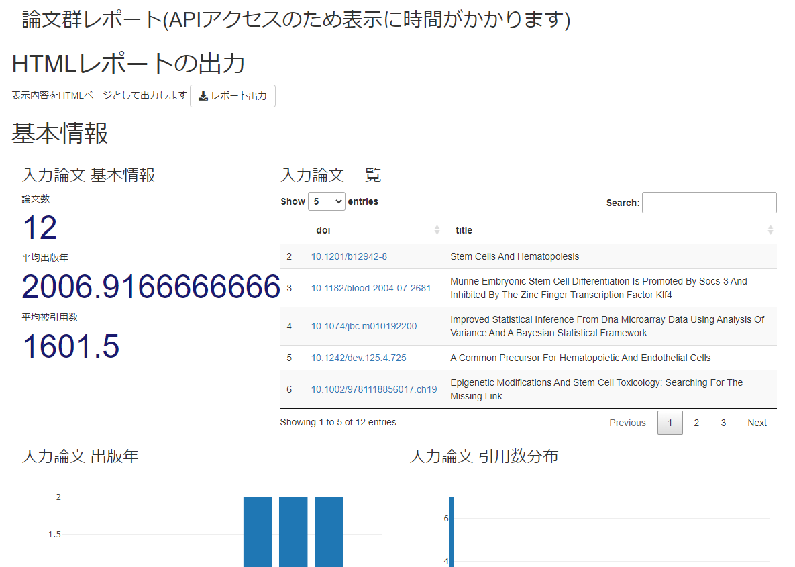
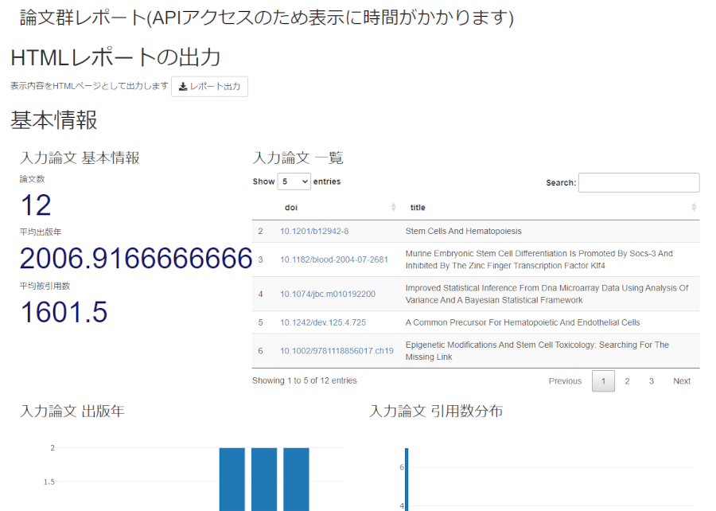

# 論文ランダムウォーク
[アプリケーションを開く](app/rw.html){:target="_blank"}

## 概要
自分で指定した任意の論文(入力は[DOI](https://ja.wikipedia.org/wiki/%E3%83%87%E3%82%B8%E3%82%BF%E3%83%AB%E3%82%AA%E3%83%96%E3%82%B8%E3%82%A7%E3%82%AF%E3%83%88%E8%AD%98%E5%88%A5%E5%AD%90){:target="_blank"})から、引用関係を”_ランダム_”にたどることができるアプリケーションです。一口に引用といってもいろいろな引用(批判的なものであったり、イントロで全く別分野のものを引用するなど)がありますので、思わぬ発見に導いてくれるかもしれません。  
研究評価において被引用数が用いられますが、単なるスカラー値の裏にあるいろいろな引用をもう一度考えるきっかけにしてみてください。もちろん、この膨大な情報を[CC0](https://creativecommons.org/publicdomain/zero/1.0/deed.ja){:target="_blank"}で公開している[OpenCitations](https://opencitations.net/){:target="_blank"}をはじめとした論文データに関するオープンデータの取り組みを知ってもらえると嬉しいです。
### こんな発見があるかも？  
- 気が付いたら全く違う内容の論文にたどり着いているかも？
- 引用をたどることで、以外と自分に近い研究分野の人に巡り合えるかも？(似た論文を引用している人は競争者か？協力者か？)
- どんなに進んでも、大御所研究グループの論文から抜け出すことができない？

## 遊び方
### １．元論文を入力する
[アプリケーション](app/rw.html){:target="_blank"}を起動します。  
最初は元の論文を入力するところから開始します。DOIを直接入力もしくはプルダウンからあらかじめプリセットされた論文を選び「スタート」ボタンを押します。  
プリセットされている論文は以下です。  
- [10.1143/JPSJ.73.2593](https://doi.org/10.1143/JPSJ.73.2593){:target="_blank"}, 113番目の元素ニホニウム発見の主要な論文の一つ  
- [10.1016/j.cell.2006.07.024](https://doi.org/10.1016/j.cell.2006.07.024){:target="_blank"}, 2021年ノーベル賞のiPS細胞発見の主要な論文の一つ  

最初の論文が表示されます。  

### ２．ランダムウォークする
論文をクリックすると、論文の基本情報が表示されます。  

「引用している論文を探す」「引用されている論文を探す」のいずれかをクリックすることでその論文が”_引用している_”論文、もしくは、その論文が”_引用されている_”論文、からランダムで一報追加されます。これを繰り返すことでランダムウォークできます。  
同じ論文から、「引用している論文を探す」「引用されている論文を探す」の両方にもランダムウォークを伸ばすことができますし、「引用している論文を探す」の中で複数の論文にランダムウォークを伸ばすこともできます。(「引用されている論文を探す」も同様)

### ３．ランダムウォークした論文群のレポートを見る
「レポートを見る」ボタンを押すとランダムウォークした論文群の情報をサマリするレポート画面に遷移します。  
※この処理はAPIをもう一度呼び出す必要があるため、最大数分程度、処理に時間がかかります。  
レポート画面にある「レポート出力」ボタンからhtmlページとしてダウンロードすることもできます。  

## 利用しているデータ
- [REST API FOR COCI, THE OPENCITATIONS INDEX OF CROSSREF OPEN DOI-TO-DOI REFERENCES](https://opencitations.net/index/coci/api/v1){:target="_blank"}.
- [Scimago Journal & Country Rank](http://www.scimagojr.com/){:target="_blank"}(サマリのみ), retrieved 2021-09-12.

## ライセンス
本アプリケーションならびに付属の説明資料等はすべて[クリエイティブ・コモンズ国際 (CC BY 4.0)](https://creativecommons.org/licenses/by/4.0/deed.ja){:target="_blank"}です。  
クレジットを記載する際には以下のように表示していただけると助かります。
- 「論文ランダムウォーク」(https://k2taro.github.io/scholarly-paper-randomwalk/) 松本尚也, 渡邊勝太郎
- ”Scholarly paper Random Walk”(https://k2taro.github.io/scholarly-paper-randomwalk/). Naoya Matsumoto, Katsutaro Watanabe.
